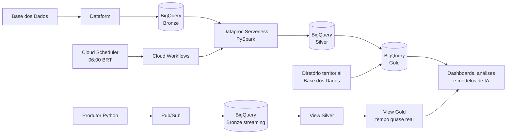

# Tech Challenge - Fase 2

Alunos:

* Artur Costa
* Davi Tolentino

Repositório do Tech Challenge da Fase 2 da pós-graduação em AI Scientist da FIAP.

O projeto implementa, no Google Cloud Platform (GCP), uma pipeline híbrida de dados para analisar o **Indicador Criança Alfabetizada**. A solução integra dados educacionais da [Base dos Dados](https://basedosdados.org/), organiza-os segundo a Arquitetura Medalhão e disponibiliza tabelas analíticas para comparar resultados de alfabetização com metas nacionais, estaduais e municipais.

Uma apresentação técnica e executiva mais visual está disponível em [`docs/relatorio_tech_challenge_fase_2.html`](docs/relatorio_tech_challenge_fase_2.html).

## Contexto do Problema

O Compromisso Nacional Criança Alfabetizada busca garantir que as crianças brasileiras estejam alfabetizadas ao final do 2º ano do ensino fundamental. A Pesquisa Alfabetiza Brasil definiu **743 pontos na escala de proficiência do Saeb** como o patamar a partir do qual uma criança é considerada alfabetizada.

Transformar esse indicador em informação útil exige combinar microdados de alunos, resultados agregados, metas educacionais e referências territoriais. O desafio desta fase consiste em construir uma plataforma de dados escalável, confiável e economicamente eficiente, capaz de atender tanto cargas históricas periódicas quanto eventos em tempo quase real.

## Objetivo

Construir uma pipeline híbrida, em nuvem, que:

* ingira dados educacionais estruturados da Base dos Dados;
* preserve os dados de origem na camada Bronze;
* limpe, padronize, valide e deduplique os registros na camada Silver;
* integre entidades heterogêneas em dimensões e fatos na camada Gold;
* compare taxas observadas de alfabetização com as metas anuais e de 2030;
* simule a chegada de novas medições por streaming;
* orquestre e monitore a execução batch;
* adote decisões de arquitetura orientadas a escalabilidade e controle de custos.

## Arquitetura da Solução



### Fluxo batch

1. O **Dataform** consulta as tabelas públicas de alfabetização e materializa cópias brutas no dataset `bronze` do BigQuery, acrescentando `_ingestao_timestamp` e `_fonte`.
2. O **Dataproc Serverless** executa os módulos PySpark de `src/silver/`, que validam schema, tipos, domínios, chaves e duplicidades.
3. Os módulos de `src/gold/` criam dimensões e fatos analíticos, respeitando a ordem de dependência definida em `src/run_pipeline.py`.
4. O **Cloud Workflows** cria o batch pela API do Dataproc, acompanha seu estado e encerra o fluxo com sucesso ou erro.
5. O **Cloud Scheduler** dispara o workflow diariamente às 06:00 no fuso `America/Sao_Paulo`.

### Fluxo streaming

1. `streaming/produtor_eventos.py` simula novas medições e publica mensagens JSON no tópico Pub/Sub `eventos-alfabetizacao`.
2. Uma BigQuery Subscription entrega as mensagens em `bronze.eventos_stream`.
3. A view `silver.medicoes_stream` interpreta o JSON, tipa os campos e normaliza a chave do município.
4. A view `gold.indicador_stream_tempo_real` mantém a medição mais recente por município, rede e ano e a enriquece com a dimensão municipal.

O batch é adequado ao grande volume histórico e às atualizações periódicas. O streaming atende eventos pequenos e frequentes sem manter infraestrutura de processamento permanentemente ativa.

## Arquitetura Medalhão

### Bronze - dados brutos

As definições SQLX em `definitions/` carregam as seguintes entidades:

* `alunos`;
* `dicionario`;
* `meta_alfabetizacao_brasil`;
* `meta_alfabetizacao_uf`;
* `meta_alfabetizacao_municipio`;
* `municipio`;
* `uf`.

Essa camada preserva os campos da origem e acrescenta metadados de rastreabilidade. O streaming também pousa primeiro em uma tabela Bronze.

### Silver - dados tratados

Os scripts PySpark promovem seis entidades para a Silver:

* `aluno`;
* `municipio`;
* `uf`;
* `meta_alfabetizacao_brasil`;
* `meta_alfabetizacao_uf`;
* `meta_alfabetizacao_municipio`.

Entre as transformações realizadas estão conversão de tipos, limpeza de texto, preenchimento do código IBGE com sete dígitos, tradução de códigos de rede, conversão de indicadores 0/1 para booleanos, validação de faixas percentuais, deduplicação por chave natural e inclusão de `_silver_timestamp`.

### Gold - camada analítica

| Tabela | Finalidade |
|---|---|
| `dim_tempo` | Horizonte de 2023 a 2030, distinguindo anos realizados e projetados. |
| `dim_uf` | UFs enriquecidas com nome e região. |
| `dim_municipio` | Municípios enriquecidos com atributos territoriais. |
| `dim_rede` | Catálogo consolidado das redes de ensino. |
| `fato_aluno` | Resultado granular por estudante. |
| `fato_indicador_municipio` | Indicadores agregados no nível municipal. |
| `fato_indicador_uf` | Indicadores agregados no nível estadual. |
| `fato_meta` | Metas de 2024 a 2030 em formato longo para Brasil, UF e município. |
| `fato_resultados` | Taxas municipais, metas, atingimento e gaps anuais e até 2030. |

As dimensões de município e UF são enriquecidas com `basedosdados.br_bd_diretorios_brasil.municipio`, uma fonte territorial externa à tabela principal do indicador.

## Qualidade e Governança de Dados

Os módulos de qualidade em `src/common/quality.py` e os relatórios de cada transformação Silver verificam:

* presença das colunas obrigatórias;
* duplicidades antes e depois da deduplicação;
* campos críticos nulos;
* formato das chaves de município, escola e aluno;
* UFs, redes, séries e cadernos fora dos domínios esperados;
* percentuais fora do intervalo de 0 a 100;
* coerência entre presença, preenchimento do caderno e alfabetização;
* proficiência e peso do aluno com valores inválidos;
* monotonicidade e preenchimento das metas anuais;
* integridade dos relacionamentos usados na Gold.

A ausência de colunas obrigatórias e determinadas violações de domínio interrompem a promoção com `QualityCheckError`. Os metadados `_fonte`, `_ingestao_timestamp` e `_silver_timestamp` apoiam rastreabilidade e auditoria.

## Tecnologias Utilizadas

| Tecnologia | Uso e justificativa |
|---|---|
| Google BigQuery | Data warehouse serverless para as três camadas, com separação lógica por datasets e cobrança por uso. |
| Dataform | Ingestão batch declarativa e versionável das tabelas públicas para a Bronze. |
| PySpark | Transformações distribuídas, adequadas a microdados educacionais de maior volume. |
| Dataproc Serverless | Executa Spark sob demanda, sem cluster permanente. |
| Cloud Workflows | Orquestra o batch e acompanha a operação do Dataproc até sua conclusão. |
| Cloud Scheduler | Agenda a execução diária da pipeline. |
| Pub/Sub | Desacopla a produção e a ingestão de eventos em tempo quase real. |
| Python | Implementa os pipelines, utilitários comuns e o simulador de eventos. |
| Base dos Dados | Fonte estruturada dos dados educacionais e do enriquecimento territorial. |

## Decisões Arquiteturais e Trade-offs

### Batch vs. streaming

O histórico e as metas mudam com baixa frequência e são processados em batch. As novas medições simuladas percorrem Pub/Sub e views do BigQuery para oferecer baixa latência. Essa combinação evita usar streaming para todo o volume e mantém um caminho rápido para eventos recentes.

### Data warehouse vs. data lake

O projeto usa BigQuery como repositório central, em vez de manter um data lake separado. A decisão simplifica governança, SQL analítico e integração com Dataform e Spark. Como trade-off, a solução fica mais acoplada ao ecossistema GCP e não preserva arquivos colunares independentes no Cloud Storage.

### Custo vs. performance

As cargas Silver e Gold usam `overwrite`, privilegiando reprodutibilidade e simplicidade. Para volumes ou frequências maiores, cargas incrementais e particionamento por ano reduziriam leitura e escrita. O pipeline completo reutiliza uma única `SparkSession`, enquanto módulos isolados podem ser executados quando apenas uma tabela precisa ser refeita.

## Monitoramento e FinOps

Decisões presentes na implementação:

* Dataproc Serverless com runtime fixado em `2.2`, evitando cluster ocioso;
* execução batch diária, em vez de computação contínua;
* views no caminho streaming, atualizadas sem job Spark permanente;
* uma única sessão Spark para o pipeline completo;
* execução seletiva com `--only silver`, `--only gold` ou módulos específicos;
* escrita direta no BigQuery e clustering das principais tabelas Silver;
* logs de início de cada etapa, relatórios de qualidade e logs de sucesso/erro no Workflow;
* polling explícito da operação do Dataproc e propagação da falha para o Workflow.

O repositório ainda não contém orçamento formal, alertas de billing, dashboard de observabilidade ou notificações automáticas. Esses itens são evoluções recomendadas para uma operação de produção, junto com particionamento e processamento incremental.

## Estrutura do Repositório

```text
.
├── definitions/                 # Dataform: ingestão das tabelas Bronze
├── docs/
│   ├── dataproc_batches.md      # Guia de execução em Dataproc Serverless
│   └── relatorio_tech_challenge_fase_2.html
├── notebooks/
│   ├── silver/                  # Notebooks originais de tratamento
│   └── gold/                    # Notebooks originais de modelagem analítica
├── orchestration/
│   ├── deploy_orchestration.sh  # Publicação do código, Workflow e Scheduler
│   └── pipeline_workflow.yaml   # Orquestração e monitoramento do batch
├── src/
│   ├── common/                  # Configuração, Spark, BigQuery e qualidade
│   ├── silver/                  # Transformações Bronze -> Silver
│   ├── gold/                    # Transformações Silver -> Gold
│   └── run_pipeline.py          # Orquestrador PySpark
├── streaming/
│   ├── produtor_eventos.py      # Simulador de eventos Pub/Sub
│   └── promocao_stream.sql      # Views Silver e Gold do streaming
├── requirements.txt
├── submit.sh                    # Submissão manual ao Dataproc Serverless
└── workflow_settings.yaml       # Configuração do projeto Dataform
```

## Como Reproduzir

### Pré-requisitos

* projeto GCP com billing ativo;
* APIs do BigQuery, Dataform, Dataproc, Workflows, Scheduler e Pub/Sub habilitadas;
* Google Cloud CLI autenticada;
* permissões de leitura na Base dos Dados e de escrita nos datasets do projeto;
* Python 3 e PySpark para desenvolvimento local;
* bucket `gs://tech-challenge-fase-2-spark` ou outro informado em `DEPS_BUCKET`.

### 1. Configuração local

```bash
python -m venv .venv
```

No Windows:

```powershell
.venv\Scripts\Activate.ps1
pip install -r requirements.txt
```

### 2. Ingestão Bronze

No Dataform, compile e execute as ações de `definitions/`. Os defaults estão em `workflow_settings.yaml`:

* projeto: `tech-challenge-fase-2-505123`;
* dataset: `bronze`;
* localização: `US`.

### 3. Pipeline batch

Para submeter o pipeline completo a partir da raiz do repositório:

```bash
bash submit.sh pipeline
```

Para executar somente um módulo:

```bash
bash submit.sh script src/silver/silver_uf.py
```

O orquestrador também aceita subconjuntos:

```bash
python -m src.run_pipeline --only silver
python -m src.run_pipeline --only gold
python -m src.run_pipeline --only silver_uf gold_dim_uf
```

Para publicar o Workflow e o agendamento diário:

```bash
bash orchestration/deploy_orchestration.sh
```

Mais detalhes estão em [`docs/dataproc_batches.md`](docs/dataproc_batches.md).

### 4. Pipeline streaming

1. Crie o tópico Pub/Sub `eventos-alfabetizacao`.
2. Configure uma BigQuery Subscription para `bronze.eventos_stream`, preservando `data` e `publish_time`.
3. Execute `streaming/promocao_stream.sql` no BigQuery.
4. Instale o cliente e inicie o produtor:

```bash
pip install google-cloud-pubsub
python streaming/produtor_eventos.py --qtd 30 --intervalo 2
```

### Variáveis de ambiente

| Variável | Default |
|---|---|
| `GCP_PROJECT_ID` | `tech-challenge-fase-2-505123` |
| `BRONZE_DATASET` | `bronze` |
| `SILVER_DATASET` | `silver` |
| `GOLD_DATASET` | `gold` |
| `BQ_CONNECTOR_PACKAGE` | `com.google.cloud.spark:spark-bigquery-with-dependencies_2.13:0.44.2` |
| `EXTERNAL_MUNICIPIO_TABLE` | `basedosdados.br_bd_diretorios_brasil.municipio` |
| `SPARK_INCLUDE_BQ_CONNECTOR_JAR` | `false` |

Para validar sem sobrescrever as tabelas principais, use datasets alternativos, por exemplo `SILVER_DATASET=silver_test` e `GOLD_DATASET=gold_test`.

## Aplicações em IA e Políticas Públicas

A camada Gold oferece uma base consistente para:

* prever a taxa de alfabetização por município e rede;
* estimar o risco de não atingimento das metas anuais ou de 2030;
* identificar desigualdades territoriais por município, UF e região;
* formar clusters de vulnerabilidade educacional;
* priorizar recursos e intervenções pedagógicas;
* acompanhar o impacto de políticas públicas ao longo do tempo.

Antes de treinamento, é necessário definir uma janela temporal e separar variáveis disponíveis no momento da previsão, evitando vazamento de informação. Dados socioeconômicos e de infraestrutura escolar podem enriquecer os modelos em versões futuras.

## Validação Antes de Produção

Como as transformações dependem de Spark, BigQuery e credenciais GCP, a validação integrada deve ser feita no Vertex AI Workbench ou em batches de teste. Para cada tabela:

1. execute o notebook original;
2. execute o script correspondente em um dataset de teste;
3. compare contagem, schema e dados com `EXCEPT DISTINCT`;
4. confira manualmente amostras das tabelas que realizam joins;
5. só então execute o pipeline completo nos datasets definitivos.

O script `gold_fato_aluno.py` escreve em `gold.fato_aluno`. O notebook original utilizava o nome `gold.fato_indicador_aluno`; consultas antigas devem ser atualizadas.

## Observação: 

Grande parte do desenvolvimento foi feito no Workbench do GCP, que estava logado no usuário do Davi no github, por isso a maioria dos commits foram centralizados nele, mas o desenvolvimento foi compartilhado por lá.